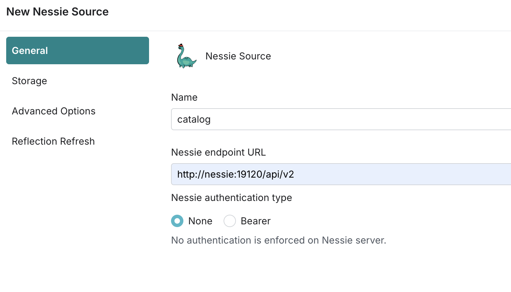

# Setting up your environment

For this course, we will be creating a data lakehouse on your laptop. We will be spinning up Minio as a local data lake, using Nessie as our data catalog, and connecting these as data sources to Dremio. This may sound complicated but is easily achieved using Docker. 

As such, make sure you have Docker installed, and if using Docker Desktop you may have to make sure you have at least 6GB of memory allocated to Docker. 

## Setting up a Minio Data Lake and Nessie Catalog

First, let's spin up our Minio object storage-based data lake and create a bucket to store our Apache Iceberg tables, which Nessie will catalog. We can spin up these services using the provided docker-compose.yml and with the command:

```
docker compose up -d minio nessie
```

Now head over to `localhost:9001` in your browser and log in to the Minio dashboard with the username "admin" and password "password".

Once you are logged in, create a bucket called `warehouse`, and we have everything we need. Feel free to visit this dashboard later on in this tutorial, after we make some Apache Iceberg tables, to see the created files.

## Starting Dremio

Next, it is time to start Dremio and get our data sources connected. Let's get Dremio started with the following command:

```
docker compose up -d dremio
```

After a minute or two, Dremio should be up and running and we can visit it in the browser at `localhost:9047` where we will have to create our initial user account. You will need to provide:
  - First Name
  - Last Name
  - Username
  - Email
  - Password

  

Your Username and Password will be used later to connect Dremio to dbt, so please remember them.

## Connecting Our Data Sources to Dremio
Once you are inside Dremio, we can begin adding our data sources by clicking the "Add Source" button in the bottom left corner.

### Add Our Nessie Source
  - Select Nessie from "Add Source"
  - On the General Tab
    - name: nessie
    - URL: http://nessie:19120/api/v2
    - auth: none
  - On the Storage tab:
    - root path: warehouse
    - access key: admin
    - secret key: password
    - connection properties:
      - fs.s3a.path.style.access : true
      - fs.s3a.endpoint : minio:9000
      - dremio.s3.compat : true
    - Encrypt Connection: false

    
    

### Add Sample Data
Again click on the "Add Source" button to bring up the "Add Data Source" pop-up window. In this list, under "Object Storage" select the option "Sample Source" which is accompanied with Gnarly, the Dremio mascot.

## Creating Iceberg tables in Nessie
The last step of our source data set-up is to create Iceberg tables from the Dremio Sample datasets. For this course we will be using the following .csv file:
  - NYC-taxi-trips.csv

Before we can turn this .csv file into an Iceberg table we first need to [format the data to a table](https://docs.dremio.com/current/sonar/data-sources/entity-promotion/). This is the process of defining how we want the file to be formatted when read in as a table into Dremio. 


In the Dremio UI, click on the left-hand-side click on Samples under your Sources, then on the next page click on "samples.dremio.com". You will now be on a page showing a list of sample data files and directories, including the two files we want for our course. Move your cursor over one of the files and you will you see an icon of a file with an arrow appear on the far right of the row, over which the tooltip will display "Format File". Click on this to display the table settings pop-up. We will use all of the default values except for one; Please tick the box to "Extract Column Names" and then click Save.

In the sample data list you should now notice that the icon for the file you formatted has changed from a grey file icon to a purple table icon. Now do the same process for the other required file.  

Now we have the two files formatted as tables we can turn these into Iceberg tables in Nessie. Go to the SQL editor and run the following two SQL statements:

```
-- Turning the CSV file into an Apache Iceberg table using CTAS
CREATE TABLE nessie.nyc.raw.trips AS SELECT * FROM Samples."samples.dremio.com"."NYC-taxi-trips.csv";
```

This code will create a main directory in Nessie called "nyc", and within that a sub-directory called "raw" into which it will write our Iceberg table, trips. Click through into this directory to see for yourself.

With that we have completed the process of setting up our Data Lakehouse and our source data.

## Creating a Python Virtual Environment and Installing dbt

Dremio has it's own dbt connector, called dbt-dremio, which we use to connect Dremio to dbt Core (connection to dbt Cloud is not yet available). This package requires Python 3.9.x or later to be installed. If you do not have Python or the required version please install or update that now. You should always isolate your python dependencies by creating a virtual environment for each project.

Command to create the environment for this course:

```
python -m venv dbt-dremio
```

This will create a `dbt-dremio` folder with your virtual environment we want to run the activate script in that folder:

- Linux/Mac `source dbt-dremio/bin/activate`
- Windows (CMD) `dbt-dremio\Scripts\activate`
- Windows (powershell) `.\dbt-dremio\Scripts\Activate.ps1`

This script will update the `pip` and `python` command in your active shell to use the virtual environment not your global python environment.

Now we can install `dbt-dremio`.

```
pip install dbt-dremio
```

With that done we now have our development environment fully set up and we are ready to move onto using dbt!